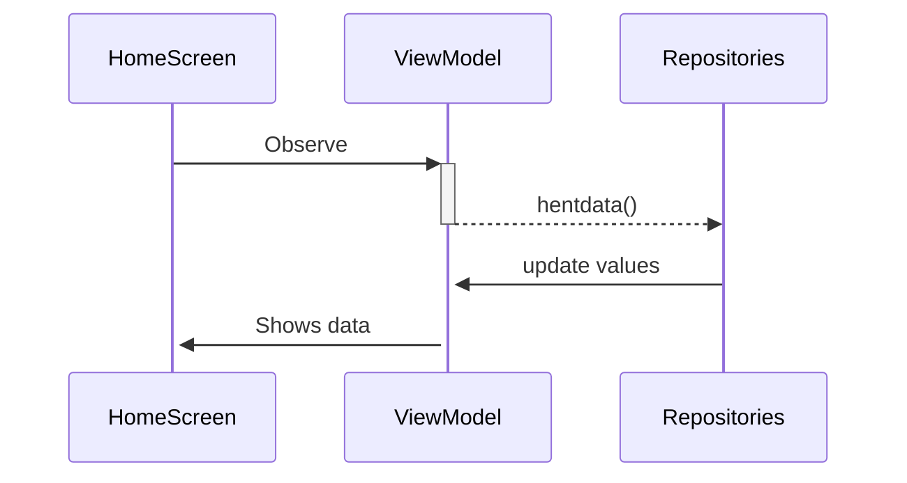
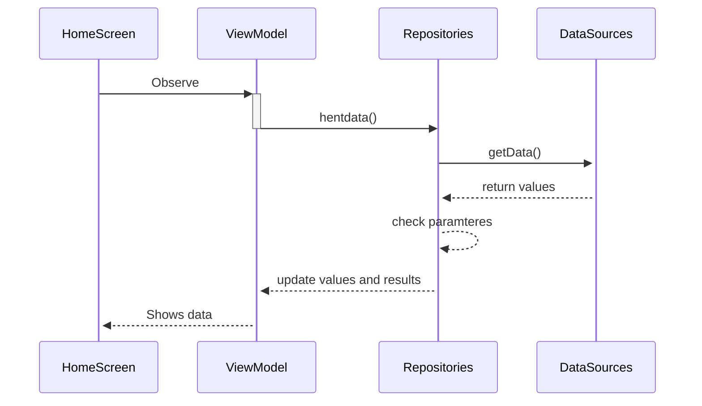
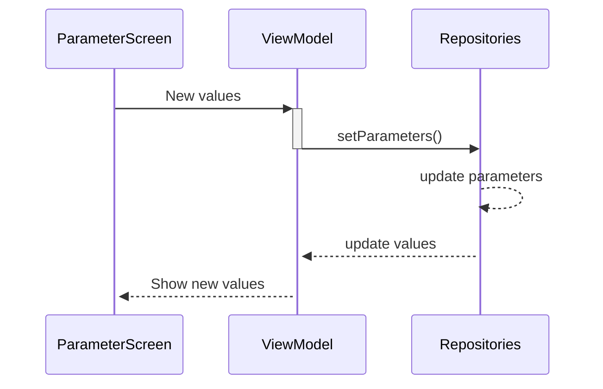
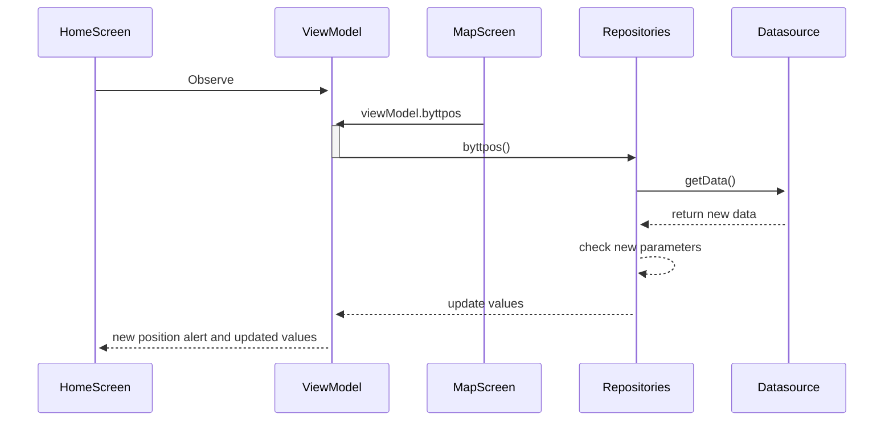
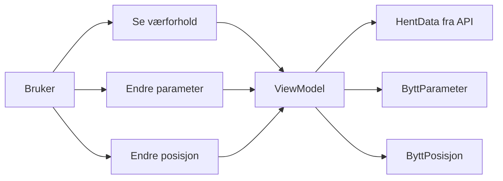
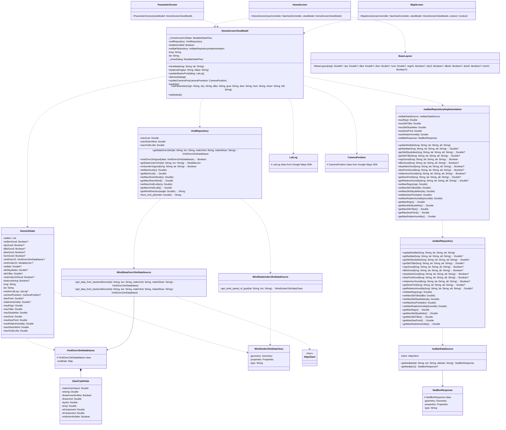
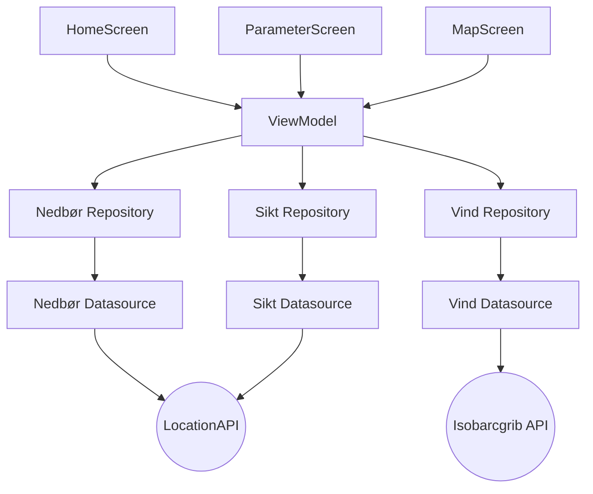
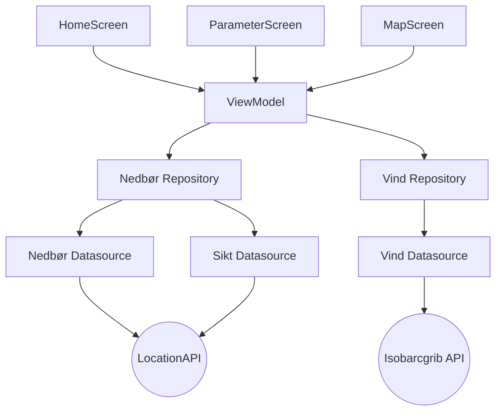

Diagrammer:

Sekvens diagram for visning av data på hjemskjerm:

Sekvens diagram for henting av data og sjekking av paramtere:

Sekvens diagram for endring av parameter:

Sekvens diagram for endring av posisjon i kart:

Use case diagram:

Klasse Diagram:
Dette klasse diagramet viser hvordan klassene samhandler med hverandre i appen.

Flowchartene viser hvordan vi får frem data fra APIene til repositories og videre til en viewmodel der skjermene tar dataen og viser det.
Flowchart V1:

Flowchart V2:
For den oppdaterte flowcharten valgte vi å kombinere nedbør repository og sikt repository.

